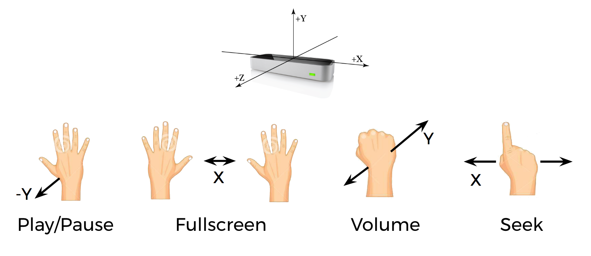

# LeaPlayer: Leap Motion-Controlled Video player
## Overview
To begin, connect Leap Motion and open jwvideo.html in Chrome or Firefox. Next, select a file from the 'videos' folder in the project directory to play. You may place your own mp4 videos in this folder to play, or choose from my set of default mp4 videos.

Follow the hand gesture instructions and the gesture feedback bar to interact with the video player via Leap Motion.

You may switch videos at any point by clicking the "Choose File" button.
## Hand Gestures

**Play/pause toggle:** Open hand, palm down, moving downwards

**Enter/exit full screen:** Two hands moving away/towards each other

**Volume adjustment:** Fist moving up/down

**Seek:** Index finger pointed towards screen, moving left/right
## Bugs
Sometimes the JW Player video player doesn't load correctly. If the video player does not have any text in the feedback bar after you choose a video file to play, just refresh the page and start over.
